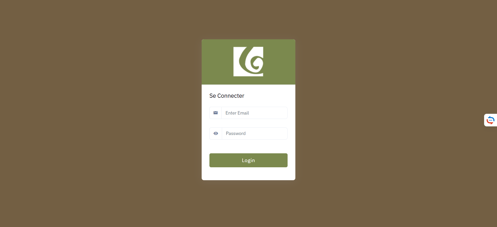
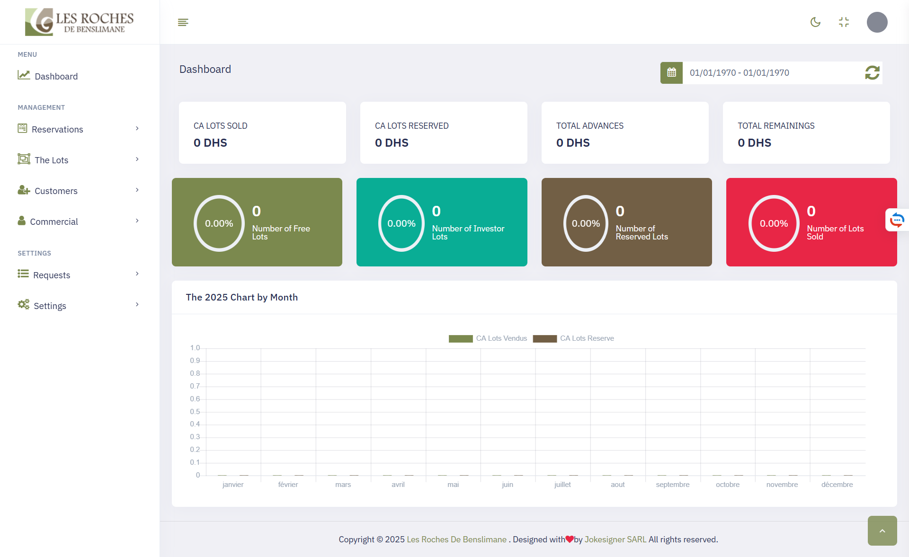
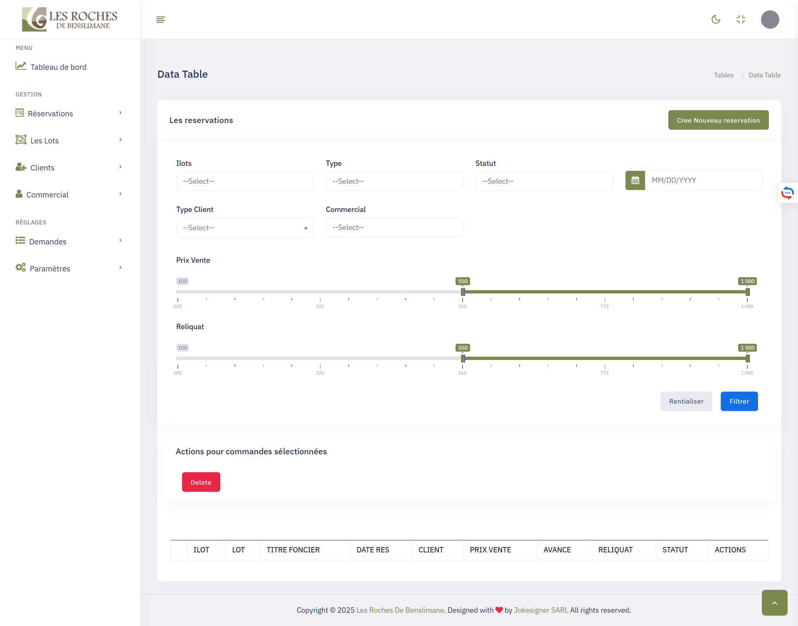

# 🏡 Real Estate App (Laravel 10)

A Laravel 10-based real estate management system that allows admins to manage properties, users, and roles. Built with PHP 8.1.

---

## 🚀 Features

-   Admin authentication system
-   Role-based access control
-   Reservation Management
-   Property listing management
-   User management
-   Fully responsive dashboard
-   Database seeder with demo admin

---

## 📸 Demo

**Admin Panel**

```
🔒 Login:
- Email: `admin@gmail.com`
- Password: `admin@2022`
```

📽️ Demo Video: _[Insert YouTube link if available]_

🌐 Live Demo: _[Insert deployed URL if available]_

---

### 🖼️ Screenshots

<p float="left">
  
  
  
  
</p>

---

## 🛠️ Technologies Used

-   Laravel 10
-   PHP 8.1
-   MySQL
-   Blade (Frontend)
-   Bootstrap 5

---

## ⚙️ Installation

> This project requires PHP 8.1+, Composer, and MySQL.

### 🧱 1. Clone the repo

```bash
git clone https://github.com/your-username/real-estate-app.git
cd real-estate-app
```

### 🔧 2. Install dependencies

```bash
composer install
```

### 🔑 3. Copy `.env` file & generate app key

```bash
cp .env.example .env
php artisan key:generate
```

### 🖥️ 4. Configure your `.env`

Set your database credentials:

```
DB_DATABASE=your_database
DB_USERNAME=your_username
DB_PASSWORD=your_password
```

### 🧬 5. Run migrations and seeders

```bash
php artisan migrate --seed
```

> This will automatically create an admin user:  
> **Email:** `admin@gmail.com`  
> **Password:** `admin@2022`

### 🚀 6. Serve the application

```bash
php artisan serve
```

Visit [http://localhost:8000](http://localhost:8000)

---

## ✅ Seeder Info

You can find and modify the seeder here:

```
database/seeders/UserSeeder.php
```

If you make changes to the seeder, re-run it:

```bash
php artisan migrate:fresh --seed
```

---

## 📂 Folder Structure

```
app/
├── Http/
├── Models/
├── Providers/
database/
├── migrations/
├── seeders/
resources/
├── views/
routes/
├── web.php
.env
```

---

## 📄 License

This project is open-source and free to use for educational and personal purposes.

---

## 🙋‍♂️ Author

Developed by **Noureddine**  
📧 [aharbachnoureddine@gmail.com]  
🔗 [GitHub Profile](https://github.com/nourddine20/)
